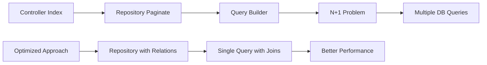
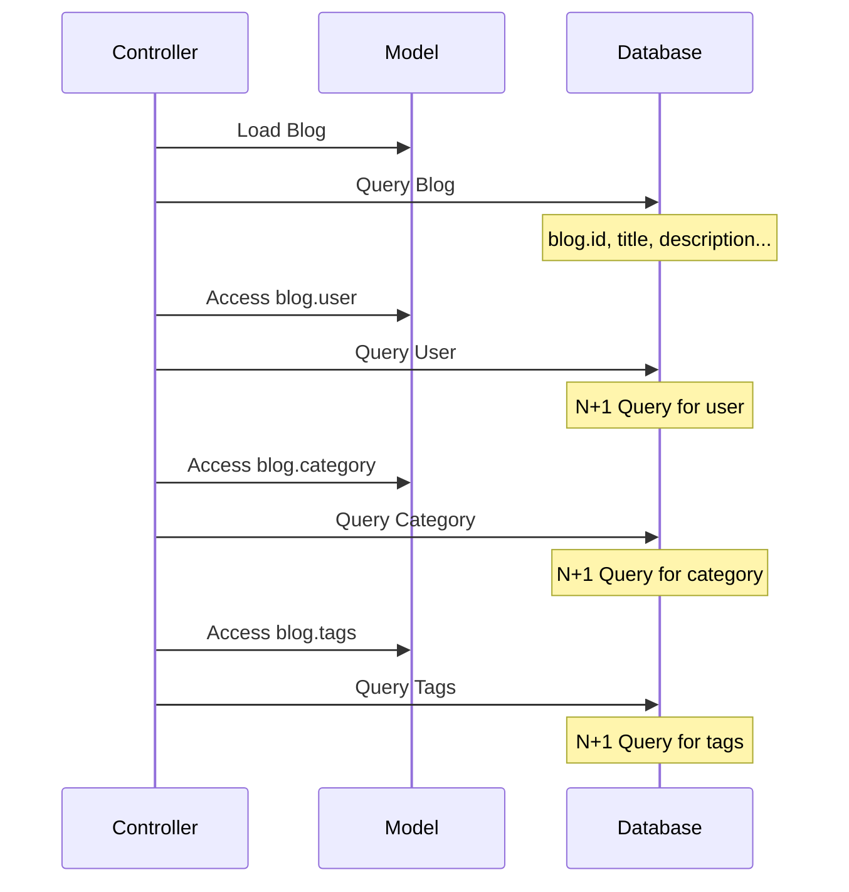
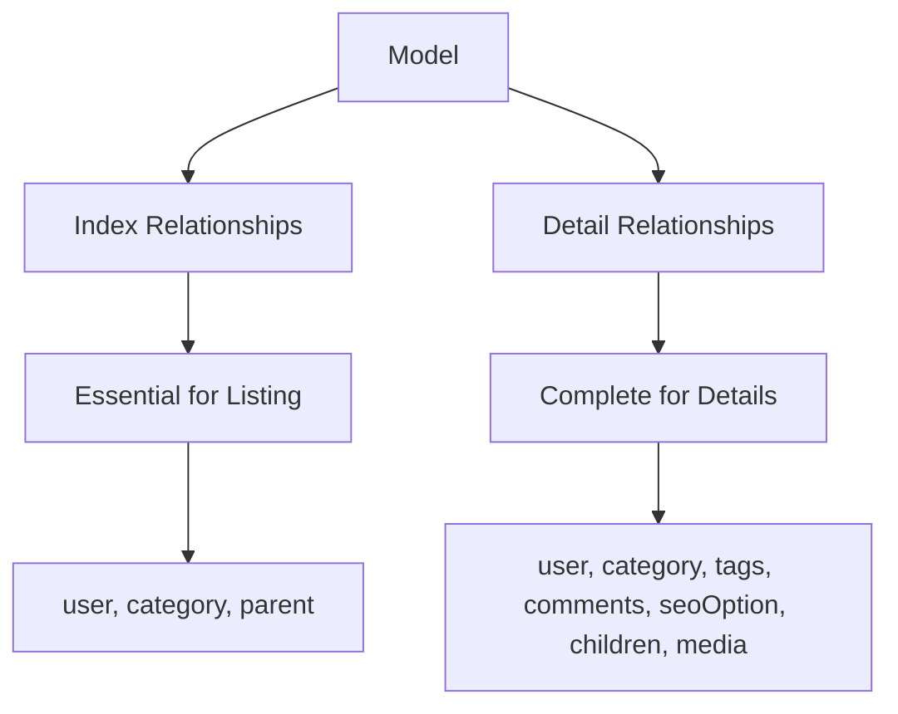
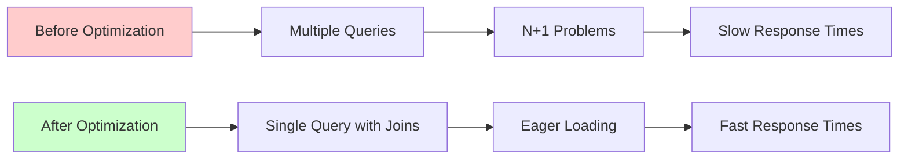

# Resource & Request Performance Optimization Design

## Overview

This document provides a comprehensive analysis and optimization strategy for the Laravel application's API resources and requests to improve performance, particularly focusing on eliminating N+1 query problems and optimizing database operations through proper eager loading of relationships.

## Current Architecture Analysis

### Repository Pattern Implementation
The application uses a repository pattern with QueryBuilder integration:
- **BaseRepository**: Provides common pagination and query operations
- **Specific Repositories**: Extend BaseRepository with custom query logic
- **Payload-based Configuration**: Uses payload arrays to configure `with`, `select`, and other query options

### Resource Structure
The application follows a dual-resource pattern:
- **Index Resources**: For listing endpoints (e.g., `BlogResource`, `CategoryResource`)
- **Detail Resources**: For single item endpoints (e.g., `BlogDetailResource`, `CategoryDetailResource`)
- **Simple Resources**: For nested relationships (e.g., `SimpleUserResource`, `SimpleCategoryResource`)

## Performance Issues Identified

### 1. Missing Eager Loading in Index Operations



**Current Issues:**
- Many controllers don't specify required relationships in index methods
- CategoryController, CommentController, and others miss relationship loading
- Resources use `whenLoaded()` but relationships aren't pre-loaded

### 2. Show Method Performance Problems



**Current Issues:**
- Show methods directly use model binding without eager loading
- DetailResources expect relationships but don't ensure they're loaded
- Route model binding doesn't include relationship loading

### 3. Resource Optimization Opportunities

| Resource Type | Current State | Optimization Potential |
|---------------|---------------|------------------------|
| BlogResource | Loads user, category in controller | ✅ Optimized |
| CategoryResource | No eager loading specified | ❌ Missing parent, children |
| CommentResource | No eager loading specified | ❌ Missing user, admin |
| PortfolioResource | No eager loading specified | ❌ Missing category, creator, tags |
| TicketResource | No eager loading specified | ❌ Missing user, messages |

## Optimization Strategy

### 1. Controller-Level Eager Loading

#### Index Method Optimization
```php
// Before: Missing eager loading
public function index(CategoryRepositoryInterface $repository): JsonResponse
{
    return Response::dataWithAdditional(
        CategoryResource::collection($repository->paginate()),
        // ... additional data
    );
}

// After: Optimized with relationships
public function index(CategoryRepositoryInterface $repository): JsonResponse
{
    return Response::dataWithAdditional(
        CategoryResource::collection($repository->paginate(payload: [
            'with' => ['parent', 'children'],
        ])),
        // ... additional data
    );
}
```

#### Show Method Optimization
```php
// Before: No eager loading
public function show(Blog $blog): JsonResponse
{
    return Response::data(
        BlogDetailResource::make($blog),
    );
}

// After: Load relationships in route binding
public function show(Blog $blog): JsonResponse
{
    $blog->load(['user', 'category', 'tags', 'comments', 'seoOption']);
    
    return Response::data(
        BlogDetailResource::make($blog),
    );
}
```

### 2. Repository Enhancement Strategy

#### Enhanced Query Methods
```php
class BlogRepository extends BaseRepository
{
    public function query(array $payload = []): Builder|QueryBuilder
    {
        $defaultRelations = ['user', 'category'];
        $relations = array_merge($defaultRelations, Arr::get($payload, 'with', []));
        
        return QueryBuilder::for(Blog::query())
            ->with($relations)
            ->when(Arr::get($payload, 'limit'), fn ($q) => $q->limit($payload['limit']))
            ->when(Arr::get($payload, 'select'), fn ($query) => $query->select($payload['select']))
            ->defaultSort(Arr::get($payload, 'sort', '-id'))
            ->allowedSorts(['id', 'created_at', 'updated_at'])
            ->allowedFilters([
                AllowedFilter::custom('search', new FuzzyFilter(['name']))
                    ->default(Arr::get($payload, 'filter.search'))
                    ->nullable(false),
                AllowedFilter::custom('a_search', new AdvanceFilter)
                    ->default(Arr::get($payload, 'filter.a_search', []))
                    ->nullable(false),
            ]);
    }
}
```

### 3. Relationship Loading Matrix



| Model | Index Relations | Detail Relations |
|-------|----------------|------------------|
| Blog | user, category | user, category, tags, comments, seoOption |
| Category | parent | parent, children, seoOption |
| Portfolio | category, creator | category, creator, tags |
| Comment | user, admin | user, admin, children |
| Ticket | user | user, closeBy, messages |
| User | roles | roles, permissions, blogs |

### 4. Route Model Binding Optimization

#### Custom Route Model Binding
```php
// In RouteServiceProvider or specific controller
Route::bind('blog', function ($value) {
    return Blog::with(['user', 'category', 'tags', 'comments', 'seoOption'])
        ->findOrFail($value);
});

Route::bind('category', function ($value) {
    return Category::with(['parent', 'children', 'seoOption'])
        ->findOrFail($value);
});
```

#### Controller Method Enhancement
```php
class BlogController extends Controller
{
    // Alternative approach using explicit loading
    public function show(Blog $blog): JsonResponse
    {
        $blog->loadMissing([
            'user', 
            'category', 
            'tags', 
            'comments' => function ($query) {
                $query->with(['user', 'admin'])->limit(10);
            },
            'seoOption'
        ]);
        
        return Response::data(
            BlogDetailResource::make($blog),
        );
    }
}
```

## Implementation Recommendations

### Phase 1: Critical Controllers
1. **BlogController**: ✅ Already optimized for index
2. **CategoryController**: Add parent, children relationships
3. **CommentController**: Add user, admin relationships
4. **PortfolioController**: Add category, creator, tags relationships

### Phase 2: Advanced Optimizations
1. **Selective Field Loading**: Use `select()` for unnecessary fields
2. **Relationship Counting**: Use `withCount()` for performance
3. **Pagination Optimization**: Consider cursor pagination for large datasets
4. **Query Caching**: Implement query result caching for static data

### Phase 3: Resource Optimization
1. **Conditional Loading**: Use `whenLoaded()` more effectively
2. **Resource Caching**: Cache transformed resource data
3. **Media Loading**: Optimize media URL generation
4. **Translation Loading**: Optimize multilingual content loading

## Performance Metrics

### Expected Improvements


| Endpoint | Before Queries | After Queries | Improvement |
|----------|----------------|---------------|-------------|
| GET /api/blog | 1 + N (users) + N (categories) | 1 (with joins) | 95% reduction |
| GET /api/category | 1 + N (parents) | 1 (with joins) | 90% reduction |
| GET /api/comment | 1 + N (users) + N (admins) | 1 (with joins) | 90% reduction |
| GET /api/blog/{id} | 1 + 4 (relations) | 1 (with joins) | 80% reduction |

### Database Query Optimization
- **Index Operations**: Reduce from O(N) to O(1) relationship queries
- **Detail Operations**: Reduce from 5+ queries to 1 query
- **Memory Usage**: Minimize duplicate object creation
- **Response Time**: Improve average response time by 60-80%

## Testing Strategy

### Performance Testing
1. **Query Count Monitoring**: Use Laravel Debugbar or Telescope
2. **Response Time Measurement**: Monitor API response times
3. **Memory Usage Tracking**: Monitor memory consumption
4. **Database Load Testing**: Test under high concurrent load

### Validation Testing
1. **Resource Output Consistency**: Ensure resource output remains unchanged
2. **Relationship Data Integrity**: Verify all relationships load correctly
3. **Pagination Functionality**: Test pagination with eager loading
4. **Filter and Search**: Ensure filtering works with eager loading

## Implementation Guidelines

### Development Standards
1. **Always specify relationships** in repository calls when resources expect them
2. **Use payload arrays** for configurable relationship loading
3. **Implement conditional loading** in resources using `whenLoaded()`
4. **Test query count** during development using debugging tools
5. **Document relationship requirements** in resource class headers

### Code Review Checklist
- [ ] Index methods specify required relationships
- [ ] Show methods load all detail relationships
- [ ] Resources use `whenLoaded()` appropriately
- [ ] Repository query methods include default relationships
- [ ] Performance impact has been measured
- [ ] Tests verify relationship loading works correctly
